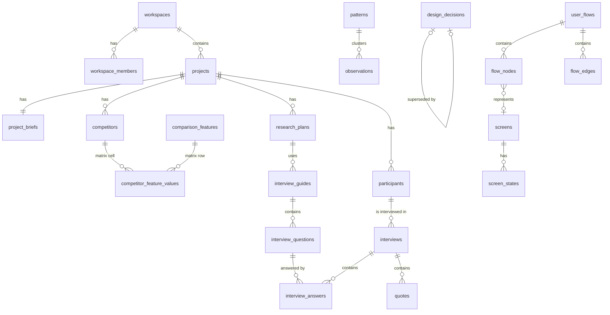

# Database — предлагаемая схема (Supabase / PostgreSQL)

Статус: Draft v0.1 — исходная логическая схема, написанная до миграций. Сейчас миграции есть: `supabase/migrations/` (001–024).
Фактическая схема — в них; там, где этот документ с ними расходится, верны миграции. Что применено в облаке, см. README → «Облако».

## 0. Общие соглашения

Каждая таблица проектного уровня содержит базовые колонки (далее «base»):

```
id            uuid pk default gen_random_uuid()
workspace_id  uuid not null  -> workspaces   (денормализация для RLS, ADR-0002)
project_id    uuid not null  -> projects on delete cascade
created_by    uuid -> profiles
updated_by    uuid -> profiles
created_at    timestamptz default now()
updated_at    timestamptz default now()   -- триггер
archived_at   timestamptz null            -- мягкое удаление/архив
```

- `code text` — человекочитаемый код (`INS-012`), уникален в пределах `(project_id, code)`, выдаётся `next_code()`.
- Rich text: `body jsonb` (TipTap) + `body_text text` (плоский) + `search tsvector generated`.
- Enum-ы — Postgres `enum` для стабильных наборов (статусы), `text + check` для тех, что будут расширяться.
- Уровень MVP / P2 / P3 указан у каждой группы.

---

## 1. Core / Projects — MVP

**profiles** — публичный профиль пользователя, `id = auth.users.id`.
`full_name, avatar_url, locale ('ru'|'uk'|'en'), created_at`

**workspaces** — пространство (личное или команды).
`id, name, slug unique, owner_id -> profiles, plan, created_at`

**workspace_members** — членство и роль. PK `(workspace_id, user_id)`.
`role enum('owner','editor','viewer'), invited_by, joined_at`

**projects** — дизайн-проект.
`id, workspace_id, name, slug, description, status enum('active','paused','done','archived'), platforms text[] ('ios','android','web','desktop'), cover_path, current_stage text, created_by, created_at, archived_at`
Unique `(workspace_id, slug)`.

**project_counters** — счётчики кодов. PK `(project_id, entity_type)`, `last_value int`.

**activity_log** — история изменений (пишется триггерами).
`id, workspace_id, project_id, actor_id, entity_type, entity_id, action ('create'|'update'|'delete'|'link'|'unlink'|'ai_accept'), changed_keys text[], created_at`

---

## 2. Discovery — MVP (market_notes — P2)

**project_briefs** — 1:1 с проектом (`project_id unique`).
`product_description jsonb, business text, target_audience text, problem text, goals jsonb (список), kpis jsonb ([{name,target,current}]), constraints text, platforms text[], timeline_start date, timeline_end date, team jsonb ([{name,role}]), links jsonb ([{title,url}]), existing_product text, business_requirements text, technical_constraints text` + base.

**competitors**
`name, url, kind ('direct'|'indirect'|'substitute'), is_own_product bool default false, positioning, target_audience, onboarding_notes, navigation_notes, ux_patterns text, ui_patterns text, strengths text, weaknesses text, pricing text, reviews_summary text, opportunities text, position int` + base.
«Our Product» — строка с `is_own_product = true`, чтобы участвовать в матрице.

**comparison_features** — строки матрицы.
`name, group_name, position` + base.

**competitor_feature_values** — ячейки матрицы. PK `(competitor_id, comparison_feature_id)`.
`value ('yes'|'no'|'partial'|'unknown'), note text`

**market_notes** (P2) — `category ('trend'|'solution'|'constraint'|'technology'|'expectation'), title, body, source_url` + base.

Скриншоты — через `attachments` (entity_type = 'competitor').

---

## 3. Research — MVP

**research_plans**
`title, goal text, questions jsonb (исследовательские вопросы), hypotheses_text text, audience text, method ('interview'|'usability'|'survey'|'diary'|'other'), participants_target int, success_criteria text, status ('draft'|'active'|'done')` + base.

**interview_guides** — сценарий интервью; может быть привязан к плану.
`research_plan_id -> research_plans null, title, intro jsonb, outro jsonb` + base.

**interview_questions**
`guide_id -> interview_guides on delete cascade, section ('intro'|'context'|'current_behavior'|'problems'|'motivation'|'experience'|'expectations'|'closing'), position int, text, probes text[], is_key bool` + base.

**participants** — отдельная сущность (не колонка таблицы).
`code ('P07'), display_name text null, role text, segment_id -> segments null (P2), segment_label text, age_range text, context text, contact text null (PII), consent_at timestamptz null, notes jsonb` + base.

**interviews**
`participant_id -> participants on delete cascade, guide_id -> interview_guides null, research_plan_id null, code ('INT-07'), conducted_at, duration_min, interviewer_id -> profiles, mode ('in_person'|'remote'|'phone'), status ('planned'|'in_progress'|'done'|'synthesized'), notes jsonb, recording_attachment_id null` + base.

**interview_answers** — ответ на вопрос (или свободный фрагмент).
`interview_id -> interviews on delete cascade, question_id -> interview_questions null (null = свободная заметка), body jsonb, body_text, position` + base.
Unique `(interview_id, question_id)` where question_id is not null.
Матрица «Question × Participant» = `interview_questions ⋈ interview_answers ⋈ interviews ⋈ participants`.

---

## 4. Synthesis — MVP

**quotes** — точный фрагмент речи участника (ADR-0003).
`code ('Q-041'), interview_id -> interviews on delete cascade, answer_id -> interview_answers null, participant_id (денорм.), text, start_offset int null, end_offset int null, timestamp_sec int null` + base.

**observations** — факт, замеченный исследователем.
`code ('OBS-102'), interview_id null, participant_id null, kind ('pain'|'need'|'behavior'|'emotion'|'fact'|'workaround'), body_text, pattern_id -> patterns null` + base.

**patterns** — кластер наблюдений на доске синтеза.
`title, description, color, position` + base. (Наблюдение → паттерн — FK `observations.pattern_id`; одно наблюдение в одном кластере на доске. Дополнительные смысловые связи — через trace_links.)

**insights**
`code ('INS-012'), title, statement text, confidence ('low'|'medium'|'high'), status ('draft'|'validated'|'rejected'), origin ('manual'|'ai_accepted')` + base.

**pain_points**
`code ('PP-008'), title, description, severity ('critical'|'high'|'medium'|'low'), segment_id null (P2), segment_label text` + base.
`frequency` не хранится — вычисляется во view `v_pain_point_stats` как число уникальных участников среди источников.

**user_needs** (P2) — `code, statement, segment_id` + base.

**opportunities**
`code ('OPP-005'), title, description, hmw text ('Как мы могли бы…'), impact ('low'|'medium'|'high'), effort ('low'|'medium'|'high'), status ('open'|'in_design'|'addressed'|'dropped')` + base.

---

## 5. Definition — P2

**segments** — `code, name, description, criteria text, size_note` + base. (Состав участников — через trace_links `participant → segment`, relation `member_of`.)
**jtbd** — `code, when_text, want_text, so_that_text, segment_id null` + base.
**problem_statements** — `code, statement, segment_id` + base.
**hypotheses** — `code, belief ('We believe that…'), target_users, expected_outcome, metric, solution text, status ('proposed'|'testing'|'validated'|'invalidated'), result text` + base.

---

## 6. Architecture — P2

**requirements** — `code ('REQ-014'), kind ('business'|'functional'|'non_functional'), title, description, priority ('must'|'should'|'could'|'wont'), source text` + base.
**features** — дерево. `code ('FT-021'), parent_id -> features null, title, description, priority, status ('idea'|'planned'|'designing'|'ready'|'shipped'), position` + base.
**user_stories** — `code, as_a, i_want, so_that, feature_id null, acceptance jsonb` + base.
**sitemap_nodes** — `parent_id null, label, screen_id -> screens null, position, node_kind ('page'|'section'|'modal'|'external')` + base.

---

## 7. Flows — MVP

**user_flows**
`code ('FL-03'), name, description, status ('draft'|'review'|'final'), viewport jsonb ({x,y,zoom})` + base.

**flow_nodes**
`flow_id -> user_flows on delete cascade, kind ('start'|'screen'|'action'|'decision'|'system'|'error'|'success'|'end'), label, screen_id -> screens null on delete set null, pos_x float, pos_y float, data jsonb` + base.

**flow_edges**
`flow_id on delete cascade, source_node_id -> flow_nodes on delete cascade, target_node_id -> flow_nodes on delete cascade, label, branch ('default'|'yes'|'no'|'error'|'back'), condition text` + base.

**flow_edge_cases** — чек-лист непродуманных состояний.
`flow_id on delete cascade, kind ('payment_failed'|'no_internet'|'unavailable'|'session_expired'|'empty'|'permission_denied'|'timeout'|'validation'|'custom'), description, status ('missing'|'covered'|'not_applicable'), node_id -> flow_nodes null` + base.

---

## 8. Design — MVP (ui_foundations — P2)

**screens**
`code ('SCR-031'), name, purpose, user_goal, entry_points text, primary_action text, secondary_actions text, content_hierarchy jsonb, permissions text, analytics_events jsonb ([{name,trigger,props}]), api_data_requirements text, status ('sketch'|'wireframe'|'prototype'|'tested'|'ready'), figma_url, figma_node_id, thumbnail_path` + base.

**screen_states**
`screen_id on delete cascade, kind ('default'|'loading'|'empty'|'error'|'success'|'disabled'|'permission_denied'|'offline'|'partial'), description, figma_url, status ('missing'|'designed'|'n_a')` + base.
Unique `(screen_id, kind)` для стандартных видов.

**ui_foundations** (P2) — `area ('typography'|'color'|'composition'|'spacing'|'grid'|'icons'|'buttons'|'forms'|'motion'|'accessibility'|'responsive'), decision text, rationale text, rules jsonb, status` + base.

---

## 9. Design System — P2

**design_tokens** — `category ('color'|'typography'|'spacing'|'radius'|'shadow'|'motion'|'breakpoint'), name ('text.body'), value jsonb ({size:16,lineHeight:24,weight:400}), mode ('light'|'dark'|null), usage text, rationale text, position` + base. Unique `(project_id, category, name, mode)`.
**components** — `code ('CMP-007'), name, category, anatomy jsonb, variants jsonb, sizes jsonb, states jsonb, properties jsonb, behavior text, accessibility text, dos jsonb, donts jsonb, figma_url, code_url, status ('draft'|'ready'|'deprecated')` + base.
**patterns_ds** — `name, problem, solution, components uuid[] (или trace_links), examples jsonb` + base.
**motion_specs** — `name, category ('transition'|'microinteraction'|'feedback'|'loading'|'navigation'|'modal'|'drag_drop'), trigger, duration_ms int, easing text, start_state, end_state, purpose` + base.
**breakpoints** — `name, min_width int, max_width int null` + base.
**responsive_rules** — `target_type ('screen'|'component'), target_id uuid, breakpoint_id, behavior ('fixed'|'fluid'|'stack'|'hide'|'replace'|'scroll'|'collapse'), note` + base.

---

## 10. Testing — P2

**usability_tests** — `code ('UT-02'), goal, scenario, prototype_url, questions jsonb, status ('planned'|'running'|'done')` + base.
**test_tasks** — `test_id on delete cascade, position, title, success_criteria` + base.
**test_sessions** — `test_id on delete cascade, participant_id -> participants, conducted_at, notes` + base.
**task_results** — PK `(session_id, task_id)`; `outcome ('success'|'partial'|'failure'), time_sec int, errors int, comment`.
**test_findings** — `code ('F-017'), test_id, title, description, severity ('critical'|'high'|'medium'|'low'), status ('open'|'fixed'|'wont_fix'), screen_id null` + base.

---

## 11. Deliver — MVP (decision log), P2 (handoff)

**design_decisions**
`code ('DEC-024'), title, context text, decision text, reason text, alternatives jsonb ([{option, why_rejected}]), status ('proposed'|'accepted'|'superseded'|'rejected'), decided_at date, author_id, superseded_by_id -> design_decisions null` + base.
Доказательства (`Interview #3`, `Usability Test #2`) — через trace_links, не текстом.

**handoff_checklist_items** (P2) — `screen_id on delete cascade, key ('desktop'|'tablet'|'mobile'|'loading'|'empty'|'error'|'success'|'disabled'|'components_documented'|'tokens_used'|'prototype_ready'|'dev_reviewed'), checked bool, checked_by, checked_at`. PK `(screen_id, key)`.

---

## 12. Cross-cutting — MVP

**trace_links** — центральная таблица traceability (ADR-0001).
```
id, workspace_id, project_id,
source_type text, source_id uuid,     -- «из чего следует» (доказательство / upstream)
target_type text, target_id uuid,     -- «что обосновано» (вывод / downstream)
relation text,                        -- см. ниже
note text null,
origin ('manual'|'ai_accepted'|'system'),
created_by, created_at
unique (project_id, source_type, source_id, target_type, target_id, relation)
```

**trace_relation_rules** — справочник допустимых связей (seed, без project_id).
`source_type, target_type, relation, label_forward, label_backward`

| relation | Смысл | Примеры пар (source → target) |
|---|---|---|
| `evidences` | источник подтверждает вывод | quote/observation/answer → insight, pain_point; finding → decision |
| `derived_from`* | вывод получен из | insight → pain_point, pain_point → opportunity, opportunity → hypothesis |
| `addresses` | решение адресует проблему | opportunity/pain_point → feature, user_flow, screen |
| `implements` | реализует | feature → user_flow, user_flow → screen, requirement → feature |
| `justifies` | обосновывает решение | любое research/test-сущность → design_decision |
| `validates` / `invalidates` | тест подтвердил/опроверг | test_finding/usability_test → hypothesis, screen, decision |
| `contradicts` | противоречие | quote/observation ↔ insight |
| `member_of` | принадлежность | participant → segment |

\* Направление всегда «upstream → downstream»: source ближе к исследованию, target ближе к интерфейсу. Это делает «пройти назад от экрана» простым обходом по `target → source`.

**Целостность:**
- `before insert/update` триггер проверяет пару в `trace_relation_rules` и что обе сущности принадлежат тому же `project_id`.
- `after delete` триггер на каждой traceable-таблице: `delete from trace_links where (source_type, source_id) = (TG_TABLE, old.id) or (target_type, target_id) = …`.
- Индексы: `(project_id, source_type, source_id)`, `(project_id, target_type, target_id)`.

**Функции:**
- `trace_graph(p_type, p_id, p_direction 'up'|'down'|'both', p_depth int default 6)` → `(type, id, depth, via_relation, path)` через recursive CTE с защитой от циклов (`path` массив).
- `v_unsupported_entities` — insights без `evidences`, pain_points без источников, screens без `addresses`/`implements` upstream, decisions без `justifies`.
- `v_pain_point_stats` — frequency = число уникальных participant_id в upstream-графе глубины ≤ 3.

**tags** — `name, color` + base; unique `(project_id, name)`.
**entity_tags** — PK `(tag_id, entity_type, entity_id)`, `workspace_id, project_id`.
**attachments** — `entity_type, entity_id, storage_path, file_name, mime, size_bytes, width, height, caption` + base.
**links** — `entity_type, entity_id, url, title, kind ('figma'|'prototype'|'code'|'doc'|'other')` + base.
**documents** — свободные заметки/отчёты: `title, body jsonb, body_text, kind ('note'|'report'|'export')` + base.
**comments** (P2) — `entity_type, entity_id, parent_id null, body jsonb, resolved_at` + base.

---

## 13. Knowledge — MVP (контент в репозитории)

Методы — MDX в `content/knowledge`, не в БД (ADR-0004). В БД только:
**knowledge_notes** (P2) — `user_id, method_slug, body jsonb` (личные заметки к методу; workspace-scoped).
**knowledge_progress** (P3) — отметки «изучено».

## 14. AI — P2

**ai_conversations** — `title, scope_type text null, scope_id uuid null` + base.
**ai_generations**
```
task ('brief_structure'|'interview_questions'|'interview_analysis'|'competitor_summary'|
      'clustering'|'contradictions'|'jtbd'|'hmw'|'hypotheses'|'edge_cases'|
      'ux_review'|'a11y_review'|'ui_consistency'|'handoff_draft'),
conversation_id null, input_refs jsonb ([{type,id}]), context_hash text,
output jsonb (валидированный по Zod), model text, input_tokens int, output_tokens int,
status ('pending'|'ready'|'failed'|'partially_accepted'|'accepted'|'rejected'),
error text, accepted_at, accepted_by
```
**ai_generation_items** — элементы вывода, принимаемые по одному.
`generation_id, item_type (insight, pain_point, hmw…), payload jsonb, evidence_refs jsonb ([{type,id,quote?}]), status ('pending'|'accepted'|'rejected'|'edited'), created_entity_type, created_entity_id`

---

## 15. Карта сущностей и ключевые связи



Смысловая цепочка (через `trace_links`):
```
participant ─ interview ─ answer ─ quote ─┐
                                observation ┴─evidences→ insight ─derived_from→ pain_point
─derived_from→ opportunity ─addresses→ (feature P2) ─implements→ user_flow ─implements→ screen
                                        any research/test entity ─justifies→ design_decision
```

## 16. RLS (схема политик)

```sql
-- security definer, stable
is_workspace_member(ws uuid, min_role text default 'viewer') returns bool

-- для каждой проектной таблицы:
select: is_workspace_member(workspace_id)
insert/update: is_workspace_member(workspace_id, 'editor')
delete: is_workspace_member(workspace_id, 'editor')   -- projects/workspace_members: 'owner'
```
Проверка согласованности `workspace_id` с `projects.workspace_id` — триггер `before insert` (подставляет из проекта, клиенту не доверяем).

## 17. Индексы (минимум)

- Все FK.
- `(project_id, archived_at)` на основных таблицах для списков.
- `(project_id, code)` unique.
- GIN на `search`.
- `trace_links` — см. §12.
- `interview_answers (interview_id, question_id)`.
